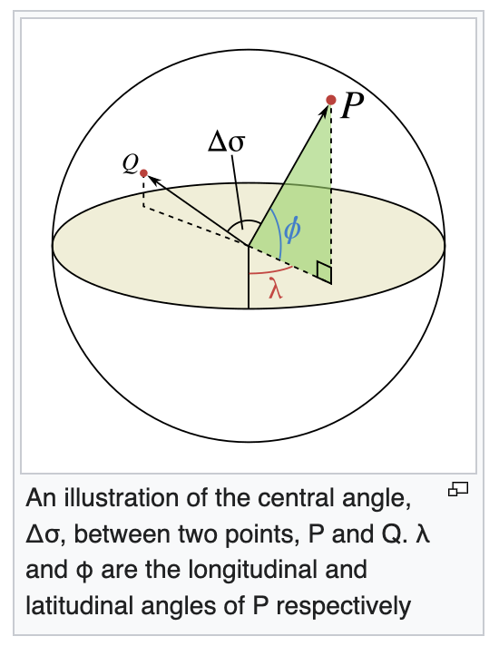

# Step 1: What Are We Actually Measuring?

## The Challenge

Imagine you want to know the distance between two cities on Earth - say, New York and London. You can easily look up their coordinates:
- **New York City**: 40.7°N, 74.0°W
- **London**: 51.5°N, 0.1°W

But how do you calculate the actual distance between them?

You might think to treat them as points in a flat plane and use the Pythagorean theorem. But Earth isn't flat - it's (approximately) a sphere! The shortest path between two cities follows the **curved surface** of the Earth, not a straight line through the planet.

This shortest curved path is called a **great circle distance** or **geodesic distance**, and it's what airplanes try to follow when flying between cities. It's also crucial for:
- Navigation and GPS systems
- Calculating shipping routes
- Astronomy (finding distances between stars on the celestial sphere)
- Any application involving positions on spherical surfaces

## Our Goal

**Given:** Two points on a sphere with known latitude and longitude, and the sphere's radius

**Find:** The distance between them along the sphere's surface

The formula we'll derive is called the **Spherical Law of Cosines**. It's been used for centuries in navigation and surveying, and it's still used today in mapping applications and GPS technology.

Let's figure out how to solve this problem from first principles!

## The Setup

For this derivation, we'll work with a perfect sphere of radius R.

**A note about Earth:** In reality, Earth is not perfectly spherical - it's an oblate spheroid, slightly flattened at the poles and bulging at the equator. The equatorial radius is 6,378.1 km while the polar radius is 6,356.8 km, a difference of about 21 km (roughly 0.3%). For most purposes, we can treat Earth as a sphere with mean radius **R = 6,371 km** (3,959 miles).

Now, how do we find the distance between two points on this sphere? It seems difficult at first, but we can take advantage of a key insight. But before we explore the key insight, let's talk about radians. A great explanation of radians can be found here: https://www.mathsisfun.com/geometry/radians.html

I'll re-hash some basic points here.

## A Quick Word About Radians

You're probably used to measuring angles in **degrees** (like 90° for a right angle, 360° for a full circle). But you may remember that there is another way to measure angles called **radians**, and they can be more natural for working with circles and spheres.

### What's a Radian?

**A radian is the angle you get when the arc length equals the radius.** 1 radian is about 57.2958 degrees.

(image)

If you wrap the radius along the circle's edge, the angle it sweeps out is exactly 1 radian!

### Key Facts
- Full circle = 360° = 2π radians (about 6.28 radians)
- Half circle = 180° = π radians
- Right angle = 90° = π/2 radians

### Why Radians Are Perfect For This Problem

Here's where radians become incredibly useful. Let's build up to the key formula step by step.

**Starting with the definition:**

Remember, 1 radian is the angle where the arc length equals the radius. So:
- If the angle is 1 radian, the arc length = 1 × radius
- If the angle is 2 radians, the arc length = 2 × radius
- If the angle is 0.5 radians, the arc length = 0.5 × radius

Do you see the pattern? The arc length is always the angle (in radians) multiplied by the radius!

**The General Formula:**

```
Arc length = Radius × Angle (in radians)
```

Or more concisely:
```
s = R × θ
```

Where s is arc length, R is radius, and θ (theta) is the angle in radians.

**Why does this work?** Because of how radians are defined! A full circle has circumference 2πR, and a full circle is 2π radians. So the arc length for 2π radians is:
```
s = R × 2π = 2πR ✓
```

It checks out! The beauty is that this simple multiplication works for **any** angle, as long as it's measured in radians.

**Examples:**

1. **On a sphere with radius 10 meters:**
   - If the angle is 0.5 radians: distance = 10 × 0.5 = **5 meters**
   - If the angle is π radians (half circle): distance = 10 × 3.14159... = **31.4 meters**
   - If the angle is 0.1 radians: distance = 10 × 0.1 = **1 meter**

2. **On Earth with radius 6,371 km:**
   - If the angle is 0.01 radians: distance = 6,371 × 0.01 = **63.71 km**
   - If the angle is 1 radian: distance = 6,371 × 1 = **6,371 km**

**What if we used degrees instead?**

If you tried to use degrees, you'd need to include conversion factors. A full circle is 360°, and its arc length is 2πR, so:
```
Arc length = R × θ(degrees) × (2π/360) = R × θ(degrees) × (π/180)
```

See how messy that is? You have to remember to multiply by π/180 every single time. With radians, it's just multiplication - no extra factors needed!

**From now on:** When we write θ (theta) for an angle, we mean **radians**. This will make all our formulas cleaner and simpler.

## Key Insight

Here's the trick: **The distance along the surface is directly related to an angle at the center of the sphere.**

If you draw lines from the sphere's center to both points, they form an angle θ (theta). 



In this image, the angle is expressed as delta sigma.

## The Beautiful Relationship

```
Distance along surface = R × θ
```

Where:
- R = radius of the sphere
- θ = angle at the center **(measured in radians!)**

**Example:** If the angle is 1 radian and radius is 10 meters, the surface distance is 10 meters. If the angle between two points is 3 radians, and the radius is 10 meters, the surfaace distance is 30 meters.

---

**So our whole problem reduces to:** How do we find the angle θ between two points when we only know their positions (latitude and longitude)?
